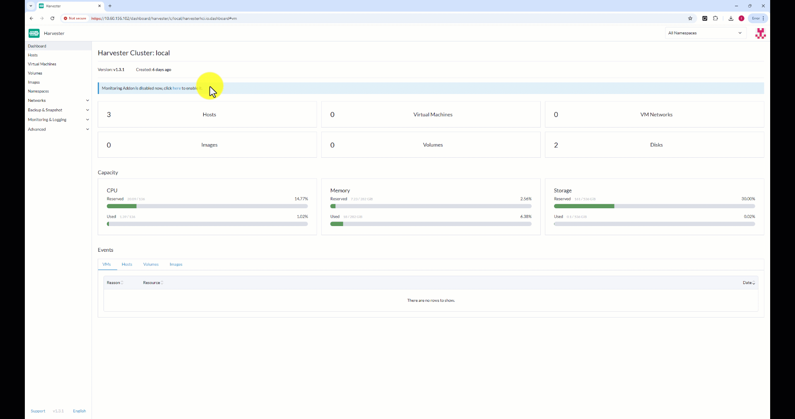

# Using Dell CSI for PowerMax on Harvester

Dell CSI drivers for PowerStore, PowerMax, PowerFlex and PowerScale
are all tested and compatible with Kubevirt.

The following article gives the instructions to install Dell CSI
for PowerMax on Harvester.
The steps are very similar no matter the storage backend.

This procedure has been tested on:

* Haverster v1.3.1
* CSM v2.11
* For PowerMax protocols Fiber Channel, iSCSI and NFS

> Note: at the time of this publication, Harvester allows 3rd party storage
> for non-boot volume or for Virtual Machine created from an ISO installation

# Documentation

Before you begin, we highly recommend to read the
[official Dell Container Storage Modules documentation](https://dell.github.io/csm-docs/docs/).
This website has all the information to deploy, configure and manage
Dell CSI drivers & other modules.

Dell CSI drivers are available as [Helm charts](https://github.com/dell/helm-charts)
or [Operator](https://operatorhub.io/).
In the following guide we will use the Helm deployment method
applied to [CSI PowerMax](https://dell.github.io/csm-docs/docs/deployment/helm/drivers/installation/powermax/).

# Connect to Harvester cluster
To use `helm` and `kubectl` let's first download the `KUBECONFIG`:


# Pre-requisites

## Connectivity

To provision & mount volumes the bare-metal nodes need access to
the REST API endpoint and the storage network.

In case of Fiber Channel, the zoning to the nodes must be done
before the installation of the CSI driver.

As part of the installation process we will need to set a
couple of parameters:
* The API endpoint; Unisphere API and possibly a backup endpoint for PowerMax
* The credentials to access the API
* The storage identifier (SymID for PowerMax)
* The storage pool

## Multipathd
When using block storage protocols like Fiber Channel, iSCSI or NVMe
it is mandatory to configure the mulitpathd service.

The below `CloudInit` configures `multipathd` to start with the node
and the `multipath.conf` makes sure only the `EMC` LUNs are part of multipathd;
not Longhorn volumes.

```bash
kubectl apply -f  https://raw.githubusercontent.com/dell/iac-storage-automation/main/kubernetes/harvester/multipathd-harvester.yaml
```

To take effect immediately you have to either restart the node or
ssh to it and start the service manually.

>Note: in case you use iSCSI you can adapt the sample file to start `iscid` daemon.
>
>Likewise for NVMe, you need to make sure `nvmf-autoconnect.service` is started.

## Namespace & Secret creation

```bash
kubectl create namespace powermax
kubectl create secret generic powermax-creds -n powermax --from-literal=username=unisphere_user --from-literal=password=your_password
```

# Helm installation
The simplest way to install Dell CSI & CSM with Helm is to use
the [Wizard](https://dell.github.io/csm-docs/docs/deployment/csminstallationwizard/src/index.html);
but first let's add the repo:

```bash
helm repo add dell https://dell.github.io/helm-charts
```


>Note: if you need to tweak more settings please refer to
>[the documentation]().

# `StorageClass` & `VolumeSnapshotClass` creation

For the `StorageClass` creation you can refer to the samples
[here](https://github.com/dell/csi-powermax/tree/main/samples/storageclass).
They contains different configuration (with or without replication, different
file system types and more).

Likewise for the `VolumeSnapshotClass` you can find [samples in the
GitHub repository](https://github.com/dell/csi-powermax/tree/main/samples/volumesnapshotclass).

# Harvester `csi-driver-config`

To enable Virtual Machine snapshots with Dell backed volume it
is necessary to add the provisionner.

To do so, go under __Advanced__ > __Settings__ > __csi-driver-config__ > __Edit Setting__.

In the case of PowerMax the configuration will look like:

```json
{
  "driver.longhorn.io": {
    "volumeSnapshotClassName": "longhorn-snapshot",
    "backupVolumeSnapshotClassName": "longhorn"
  },
  "csi-powermax.dellemc.com": {
    "volumeSnapshotClassName": "powermax-snapclass",
    "backupVolumeSnapshotClassName": "powermax-snapclass"
  }
}
```
